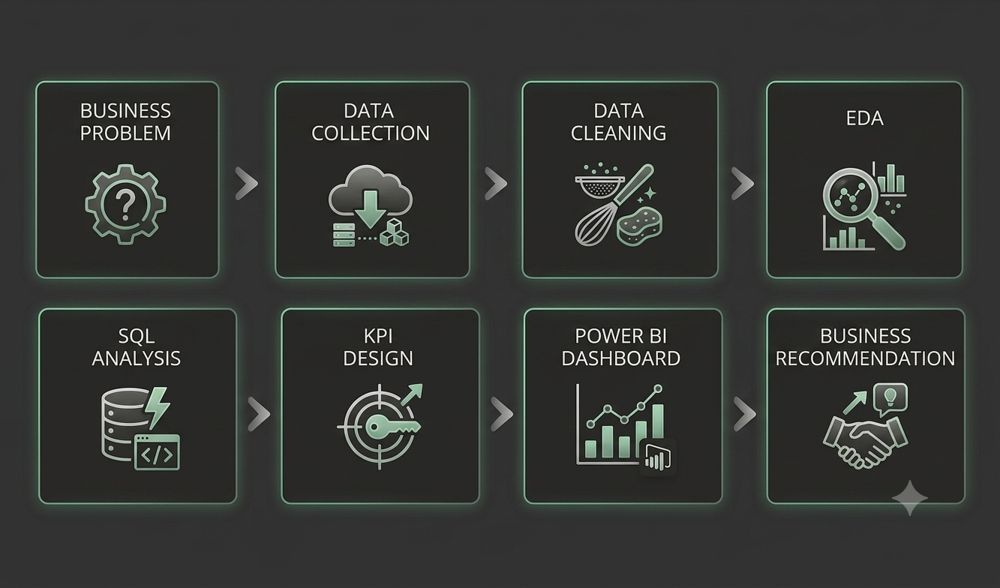

# Customer Churn & Revenue Leakage Analytics

> An end-to-end Data Analytics project that simulates how a SaaS company can analyze customer churn, identify revenue leakage, and transform business data into actionable insights through SQL, Python, and Power BI.

---

# Project Overview

Retensi pelanggan merupakan salah satu faktor keberhasilan paling krusial bagi bisnis berbasis langganan. Kehilangan pelanggan tidak hanya menurunkan pendapatan berulang, tetapi juga meningkatkan biaya akuisisi pelanggan serta menghambat pertumbuhan bisnis jangka panjang.

Proyek ini mensimulasikan skenario bisnis SaaS di dunia nyata di mana customer, subscription, payment, product usage, and support ticket dianalisis untuk memahami perilaku churn dan dampak finansialnya.

Proyek ini mengikuti alur kerja analitik yang berorientasi pada industri, dimulai dengan business understanding and synthetic data generation, followed by data validation, exploratory analysis, SQL analytics, KPI development, dashboard creation, and business recommendations.

Alih-alih hanya berfokus pada pembuatan dasbor, proyek ini menekankan analytical thinking, business storytelling, and decision support.

---

# Business Problem

Perusahaan mengalami pembatalan layanan dalam jumlah yang signifikan oleh pelanggan, yang berdampak pada kebocoran pendapatan (*revenue leakage*) serta ketidakpastian mengenai segmen pelanggan mana yang membutuhkan perhatian segera.

Manajemen ingin menjawab pertanyaan-pertanyaan bisnis berikut:

* Berapa tingkat churn pelanggan saat ini?
* Segmen pelanggan mana yang menyumbang churn tertinggi?
* Paket berlangganan mana yang menghasilkan pendapatan tertinggi?
* Berapa banyak pendapatan yang hilang dari pelanggan yang churn?
* Apakah kinerja dukungan pelanggan berkorelasi dengan churn pelanggan?
* Kelompok pelanggan mana yang harus menjadi fokus utama dalam strategi retensi?

---

# Project Objectives

Tujuan utama proyek ini adalah:

* Menganalisis karakteristik dan tren perilaku churn pelanggan.
* Mengukur pendapatan bisnis berjalan serta volume kebocoran dana (*revenue leakage*).
* Mengidentifikasi segmen pelanggan yang memiliki risiko tinggi untuk kabur.
* Mengembangkan standarisasi tata kelola metrik bisnis (*Business KPIs*).
* Melakukan analisis bisnis lanjutan berbasis kueri SQL.
* Membangun executive dashboard interaktif untuk pemantauan bisnis secara makro.
* Menyediakan rekomendasi bisnis taktis yang dapat langsung dieksekusi berdasarkan temuan analitis.


---

# Dataset Overview

This project uses a synthetic relational dataset representing a SaaS subscription business.

The dataset consists of five related tables:

| Table           | Description                                                        |
| --------------- | ------------------------------------------------------------------ |
| Customers       | Informasi demografis dan saluran akuisisi pelanggan                |
| Subscriptions   | Paket langganan, status, masa lama berlangganan (*tenure*), dan harga |
| Payments        | Riwayat transaksi pembayaran pelanggan                             |
| Product Usage   | Keterikatan penggunaan produk dan aktivitas fitur                  |
| Support Tickets | Rekam medis komplain dan interaksi bantuan pelanggan               |


### Dataset Summary

| Metric                |    Value |
| --------------------- | -------: |
| Total Customers       |   20,000 |
| Product Usage Records | ~500,000 |
| Support Tickets       |  ~40,000 |
| Payment Records       | ~250,000 |
| Tables                |        5 |

---

# Project Workflow

The project follows an end-to-end analytics lifecycle.

<p align="center">

</p>

Workflow:

1. Business Understanding
2. Synthetic Dataset Generation
3. Data Cleaning & Validation
4. Exploratory Data Analysis
5. SQL Business Analytics
6. KPI Development
7. Dashboard Development
8. Business Recommendations

---

# Project Architecture

The analytical pipeline used throughout the project is illustrated below.

<p align="center">

</p>

Pipeline:

```
Synthetic Dataset
        │
        ▼
Python (Cleaning & EDA)
        │
        ▼
PostgreSQL
        │
        ▼
SQL Analytics
        │
        ▼
Power BI Dashboard
        │
        ▼
Business Recommendations
```

---

# Technology Stack

| Category             | Technology     |
| -------------------- | -------------- |
| Programming Language | Python         |
| Data Processing      | Pandas, NumPy  |
| Data Visualization   | Matplotlib     |
| Database             | PostgreSQL     |
| SQL                  | PostgreSQL SQL |
| Dashboard            | Power BI       |
| Version Control      | Git & GitHub   |
| IDE                  | VS Code        |

---

# Data Model

The project follows a relational data model connecting customers, subscriptions, payments, product usage, and support tickets.

<p align="center">

</p>

Primary relationships:

* Customers → Subscriptions
* Customers → Payments
* Customers → Product Usage
* Customers → Support Tickets

---

# Project Structure

```
Customer-Churn-Revenue-Analytics/
│
├── data/
│   ├── raw/
│   └── processed/
│
├── notebooks/
│
├── sql/
│
├── dashboard/
│
├── reports/
│   ├── business_understanding.md
│   ├── data_quality_report.md
│   ├── eda_report.md
│   ├── kpi_dictionary.md
│   └── business_recommendations.md
│
├── images/
│   ├── dashboard.png
│   ├── data_model.png
│   ├── workflow.png
│   └── project_architecture.png
│
├── README.md
└── requirements.txt
```

---

# Key Business Insights

Analysis of the dataset revealed several important business findings:

* Customer churn rate reached **25.24%**, indicating that approximately one out of every four customers discontinued their subscription.
* The **Basic** subscription plan exhibited the highest churn rate, suggesting that entry-level customers require stronger onboarding and retention strategies.
* Customers from **Small** companies showed higher churn than Medium and Large organizations.
* Customers who churned generally created more support tickets, indicating a potential relationship between service experience and retention.
* Historical revenue associated with churned customers reached approximately **$4.99 million**, highlighting substantial revenue leakage.
* Customer acquisition channels showed relatively similar churn behavior, suggesting that post-acquisition customer experience is a more influential factor than acquisition source.

---

# Dashboard Preview

The Power BI dashboard was designed for executive-level monitoring and operational decision making.

Dashboard pages include:

* Executive Overview
* Customer & Churn Analysis
* Revenue Analytics
* Support & Product Engagement

---

# Business Recommendations

Berdasarkan temuan analitis, beberapa rekomendasi strategis diusulkan sebagai berikut:

### 1. Improve Basic Plan Retention

Kembangkan program orientasi (*onboarding*) yang terstruktur, edukasi fitur, serta penawaran promosi langganan tahunan untuk mengurangi churn di kalangan pelanggan tingkat awal.

### 2. Strengthen Customer Success for Small Businesses

Sediakan pengalaman orientasi yang disesuaikan serta keterikatan pelanggan secara proaktif bagi pelanggan bisnis kecil, yang mewakili segmen dengan risiko tertinggi.

### 3. Optimize Customer Support Operations

Tingkatkan service-level agreements (SLA), pangkas waktu penyelesaian masalah, dan pantau kasus bantuan yang berulang untuk meningkatkan kepuasan pelanggan.

### 4. Monitor Revenue Leakage

Tetapkan pemantauan berkelanjutan terhadap churn dan hilangnya pendapatan melalui dashboard eksekutif serta tinjauan KPI bulanan.


---

# Future Improvements

Potential enhancements for future iterations include:

1. Optimalisasi Desain Layout & UX Dashboard
2. Migrasi ke Kumpulan Data Riil Dunia Nyata (Real-World Dataset)
3. Implementasi Analitik Prediktif Menggunakan Machine Learning
4. Pendalaman Eksplorasi Data (Deep-Dive EDA Report)
5. Otomatisasi Pipeline Data & Jadwal Pembaruan Grafik (Automated Daily Refresh)


---

# Repository Information

**Project Type:** End-to-End Data Analytics Portfolio

**Domain:** SaaS Customer Analytics

**Focus Areas:**

* Customer Churn Analysis
* Revenue Leakage Analytics
* SQL Analytics
* KPI Development
* Executive Dashboard
* Business Intelligence

---

## Acknowledgements
Proyek ini dikembangkan sebagai proyek portofolio untuk menyimulasikan alur kerja analisis data berstandar industri, yang memadukan pemahaman bisnis, *analytics engineering*, SQL, visualisasi data, dan komunikasi bisnis ke dalam satu solusi menyeluruh (*end-to-end*).